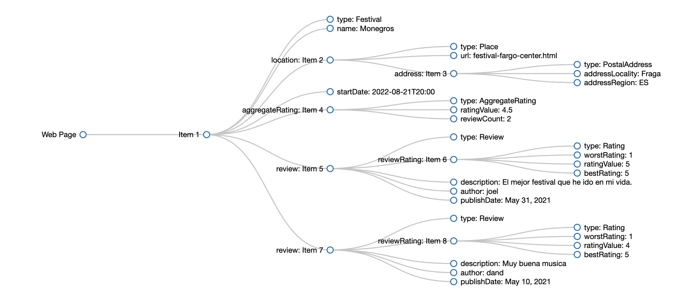
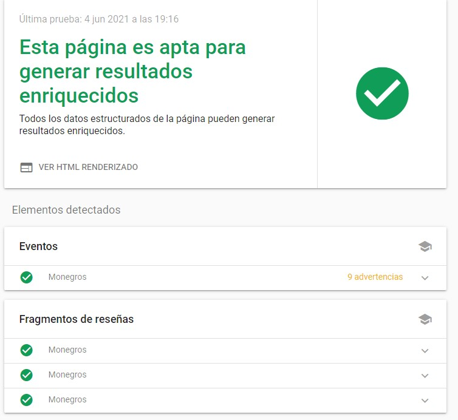

# webproject 💻
Web Project - [*TopFestivals*][1]

[1]: https://github.com/dandmase/webproject
## Table of contents 🎯

1. [Collaborators](#collaborators-)
2. [Tecnologies](#tecnologies-)
3. [How to RUN](#how-to-run-)
    - [Requisites](#requisites-)
    - [Running Project](#running-project-)
    - [Users](#users-)
4. [Design considerations](#design-considerations-)
5. [RDF Considerations](#rdf-considerations-)
    - [RDF page code](#rdf-page-code-)
    - [Schema RDF](#schema-rdf-)
    - [Google Rich Results Test](#google-rich-results-test-%EF%B8%8F)

## Collaborators 👷
* Dand Marbà
* Joel Romia
* José Ramón Noguero

## Tecnologies 🎓

For the development of the business model of TopFestivals we use the following tecnologies:
- [X]  Use of **Framework Django** 


## How to RUN 🔧
### Requisites 📋  
- [X] This project uses [*python 3.9*][2] and pip.
- [X] Open requirements.txt and install all de requeriments.

[2]: https://www.python.org/downloads/release/python-394/ "Download Python 3.9"
  
### Running Project 💡
First of all you *need to clone the repository* before the requeriments part:  
Check your python version 
```console
$ python3 -V
```
Finally:
```console
$ sudo apt install python3-django
$ python manage.py runserver
```

### Users 👨
http://127.0.0.1:8000/admin/
  - *Admin* User
    * Username : *admin*
    * Password : *admin*

  - *Normal* User
    * Username : *provauser*
    * Password : *user1234*

## Design considerations 🎨
We wanted a webpage with a lot of festivals where people can add a comment about that festival. So in the main page we think that should appear all the registered festivals with a picture of it and some few details.

Then when you want to see the information of a festival or the comments that users had add, you have to click te name of he festival and the user would be redirectioned to another page with all the information about the festival,
the comments and all the artist that will play. 

When all the functionalities worked correctly, we had concentrated on the design of the page trying differnt kinds of disgn we finally choose this. 
And we do the same design when you want to see the information of an artist.

## RDF Considerations 🌍

### RDF page code 📌

```html
<!DOCTYPE html>
<html lang="en">
<head>
<title>TopFestivals - Monegros</title>
</head>
<body>
<div id="header">
 <p>User Joel (<a href="/accounts/logout/?next=/topfestivals/">logout</a>)</p>
</div>
<div id="sidebar">
 <ul><li><a href="/topfestivals/">Home</a></li></ul>
</div>
<div id="content">
<span vocab="http://schema.org/" typeof="Festival">
<h1><span property="name">Monegros</span>
 (<a href="/topfestivals/festival/1/edit/">edit</a>)
</h1>
<h2>Address:</h2>
<div property="location" typeof="Place">
    <a property="url" href="festival-fargo-center.html">
    Monegrps
    </a>
    <div property="address" typeof="PostalAddress">
      <span property="addressLocality">Fraga</span>,
      <span property="addressRegion">ES</span>
    </div>
  </div>
  <meta property="startDate" content="2022-08-21T20:00">
    Thu, 08/21/22
    8:00 p.m.
<h2>Artists (<a href="/topfestivals/festival/1/artist/create/">add</a>)</h2>
<ul>
 <li><a href="/topfestivals/festival/1/artist/1/">Andres Campo</a></li>
 <li><a href="/topfestivals/festival/1/artist/3/">Carl Cox</a></li>
 <li><a href="/topfestivals/festival/1/artist/4/">Paco Osuna</a></li>
</ul>
<h2>Reviews</h2>
<span rel="aggregateRating">
 <p typeof="AggregateRating">
 Average rating <span property="ratingValue">4.5</span>
 from <span property="reviewCount">2</span> reviews
 </p>
</span>
<ul rel="review">
 <li typeof="Review">
 <p rel="reviewRating" typeof="Rating">
 <span property="worstRating" content="1"></span>
 <span property="ratingValue">5</span> stars
 <span property="bestRating" content="5"></span>
 </p>
 <p property="description"> El mejor festival que he ido en mi vida. </p>
 <p>Created by <span property="author">joel</span> on
 <span property="publishDate">May 31, 2021</span></p>
 </li>
 <li typeof="Review">
 <p rel="reviewRating" typeof="Rating">
 <span property="worstRating" content="1"></span>
 <span property="ratingValue">4</span> stars
 <span property="bestRating" content="5"></span>
 </p>
   <p property="description">Muy buena musica</p>
 <p>Created by <span property="author">dand</span> on
 <span property="publishDate">May 10, 2021</span></p>
 </li>
</ul>
</span>

</body>
</html>
```

### Schema RDF 📑



### Google Rich Results Test✔️


